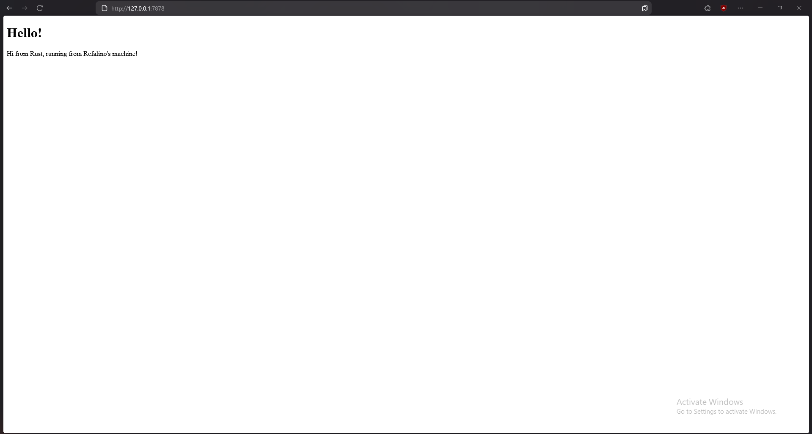

# Advanced Programming Module 6

## Reflection Notes: Handling Connections and Checking Responses
In this milestone I implemented a basic single-threaded web server in rust. Using a `Tcplistener` I established a connection in the server `127.0.0.1:7878`. The following is the code I used:

```Rust
use std::net::TcpListener;

fn main() {
    let listener = TcpListener::bind("127.0.0.1:7878").unwrap();

    for stream in listener.incoming() {
        let stream = stream.unwrap();
        println!("Connection established!");
    }
}
```

This is the response when I ran the program:

```
Request: [
    "GET / HTTP/1.1",
    "Host: 127.0.0.1:7878",
    "User-Agent: Mozilla/5.0 (Windows NT 10.0; Win64; x64; rv:136.0) Gecko/20100101 Firefox/136.0",
    "Accept: text/html,application/xhtml+xml,application/xml;q=0.9,*/*;q=0.8",
    "Accept-Language: en-US,en;q=0.5",
    "Accept-Encoding: gzip, deflate, br, zstd",
    "Sec-GPC: 1",
    "Connection: keep-alive",
    "Upgrade-Insecure-Requests: 1",
    "Sec-Fetch-Dest: document",
    "Sec-Fetch-Mode: navigate",
    "Sec-Fetch-Site: none",
    "Sec-Fetch-User: ?1",
    "Priority: u=0, i",
]
```

## Reflection Notes: Returning HTML

In this part of the tutorial, I extend the TCP server to respond towards HTTP requests with a simple HTML page named `hello.html`. The current code I am using is this:

```Rust
use std::{
    fs,
    io::{prelude::*, BufReader},
    net::{TcpListener, TcpStream},
};


fn main() {
    let listener = TcpListener::bind("127.0.0.1:7878").unwrap();


    for stream in listener.incoming() {
        let stream = stream.unwrap();


        handle_connection(stream);
    }
}


fn handle_connection(mut stream: TcpStream) {
    let buf_reader = BufReader::new(&mut stream);
    let _http_request: Vec<_> = buf_reader
        .lines()
        .map(|result| result.unwrap())
        .take_while(|line| !line.is_empty())
        .collect();


    let status_line = "HTTP/1.1 200 OK";
    let contents = fs::read_to_string("hello.html").unwrap();
    let length = contents.len();

    let response = format!("{status_line}\r\nContent-Length: {length}\r\n\r\n{contents}");
    stream.write_all(response.as_bytes()).unwrap();
}
```

After doing this step, I can view my webpage. This is what my webpage looks like so far:



## Reflection Notes: Validating Request and Selectively Responding

What I've learned in this part of the tutorial is differentiating responses based on request path. Other than that, it also taught us error handling and how one can return a 404 response after encountering an error. 

This is what my erorr page looks like:


And this is what I changed in my code to achieve this error page:

```Rust
use std::{
    fs,
    io::{prelude::*, BufReader},
    net::{TcpListener, TcpStream},
};


fn main() {
    let listener = TcpListener::bind("127.0.0.1:7878").unwrap();


    for stream in listener.incoming() {
        let stream = stream.unwrap();


        handle_connection(stream);
    }
}


fn handle_connection(mut stream: TcpStream) {
    let buf_reader = BufReader::new(&mut stream);
    let request_line = buf_reader.lines().next().unwrap().unwrap();
    
    let (status_line, filename) = if request_line == "GET / HTTP/1.1" {
        ("HTTP/1.1 200 OK", "hello.html")
    } else {
        ("HTTP/1.1 404 NOT FOUND", "404.html")
    };

    let contents = fs::read_to_string(filename).unwrap();
    let length = contents.len();

    let response = format!("{status_line}\r\nContent-Length: {length}\r\n\r\n{contents}");
    stream.write_all(response.as_bytes()).unwrap();
}
```

## Reflection Notes: Simulating Slow Requests

In this part of the tutorial, we were taught to think about if there are a lot of users trying to enter our website. This will surely cause some traffic and slow down the website's loading. This part of the tutorial teaches us a more efficient way of loading so that our website does not slow down as much when there are multple users trying to access it.

## Reflection Notes: Multithreaded Server using Threadpool

During this part of the tutorial, we were taught to transform the server into a multithreaded application by implementing a thread pool. This allows concurrent request handling. 

Using these new implementations, it significantly improves server performance by enabling parallel request processing. The implementation is all in the `lib.rs` as follows:

```rust
use std::{
    sync::{mpsc, Arc, Mutex},
    thread,
};

pub struct ThreadPool {
    workers: Vec<Worker>,
    sender: mpsc::Sender<Job>,
}

type Job = Box<dyn FnOnce() + Send + 'static>;

impl ThreadPool {
    pub fn new(size: usize) -> ThreadPool {
        assert!(size > 0);
        let (sender, receiver) = mpsc::channel();
        let receiver = Arc::new(Mutex::new(receiver));
        let mut workers = Vec::with_capacity(size);
        
        for id in 0..size {
            workers.push(Worker::new(id, Arc::clone(&receiver)));
        }

        ThreadPool { workers, sender }
    }
    
    pub fn execute<F>(&self, f: F)
    where
        F: FnOnce() + Send + 'static,
    {
        let job = Box::new(f);
        self.sender.send(job).unwrap();
    }
}

struct Worker {
    id: usize,
    thread: thread::JoinHandle<()>,
}

impl Worker {
    fn new(id: usize, receiver: Arc<Mutex<mpsc::Receiver<Job>>>) -> Worker {
        let thread = thread::spawn(move || loop {
            let job = receiver.lock().unwrap().recv().unwrap();
            println!("Worker {id} got a job; executing.");
            job();
        });

        Worker { id, thread }
    }
}
```